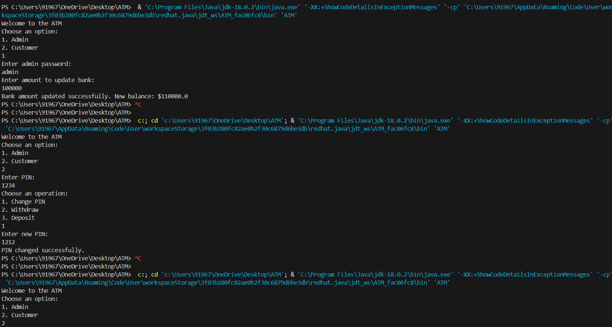

# ATM_Console_App_Java

<h1>Java ATM Console Application</h1>

This repository contains a simple ATM console application implemented in Java. The application allows users to perform various banking operations such as withdrawal, deposit, PIN change, and bank management.

<h2>Features:</h2>
<b>Admin Module:</b>Allows management of the bank amount by updating it. 
<b>Customer Module:</b> Enables customers to change their PIN, withdraw money, and deposit money into their accounts. 
<b>Bank Module:</b> Maintains the total bank amount and provides access to admin and customer functionalities.

<h2>Usage:</h2>
Run the ATM.java file. 
Choose between the Admin or Customer module. 
If selecting Admin, enter the password to manage the bank amount. 
If choosing Customer, enter the PIN to perform operations on the account.

<h2>Requirements:</h2>
Java Development Kit (JDK) 
IDE or command-line compiler for Java

<h2>Screenshots: </h2>

 

